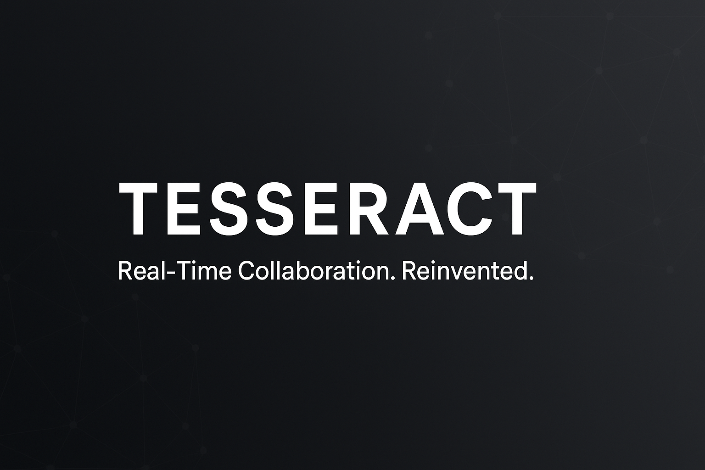

<!-- Banner -->


<!-- Badges -->


# 🚀 TESSERACT
**Real-Time Collaboration. Reinvented.**  
A next-generation team collaboration platform merging the power of **Slack**, **Trello**, and **GitHub** into one seamless experience.

---

## ✨ Features
- ⚡ **Real-time Messaging** with WebSockets & Django Channels
- 📌 **Interactive Kanban Boards** with drag-and-drop tasks
- 📂 **File Sharing** with cloud integration
- 🔔 **Smart Notifications** (in-app, push, email)
- 🛠 **Developer Tools**: Git integration, code snippets, markdown wiki
- 🔒 **Secure Authentication** with JWT

---

## 🖥️ Tech Stack
| Backend | Frontend | Database | Deployment |
|---------|----------|----------|------------|
| Django, Django REST Framework, Django Channels | React (planned), Tailwind CSS | PostgreSQL | Docker, Nginx, CI/CD |

---

## 📷 Screenshots
| Login | Dashboard | Kanban |
|-------|-----------|--------|
|  |  |  |

---

## 🚀 Getting Started
```bash
# Clone the repo
git clone https://github.com/YOUR_USERNAME/Tesseract.git

# Go to project folder
cd Tesseract

# Create virtual environment
python -m venv venv
venv\Scripts\activate  # Windows
source venv/bin/activate  # Mac/Linux

# Install dependencies
pip install -r requirements.txt

# Run migrations
python manage.py migrate

# Start development server
python manage.py runserver
